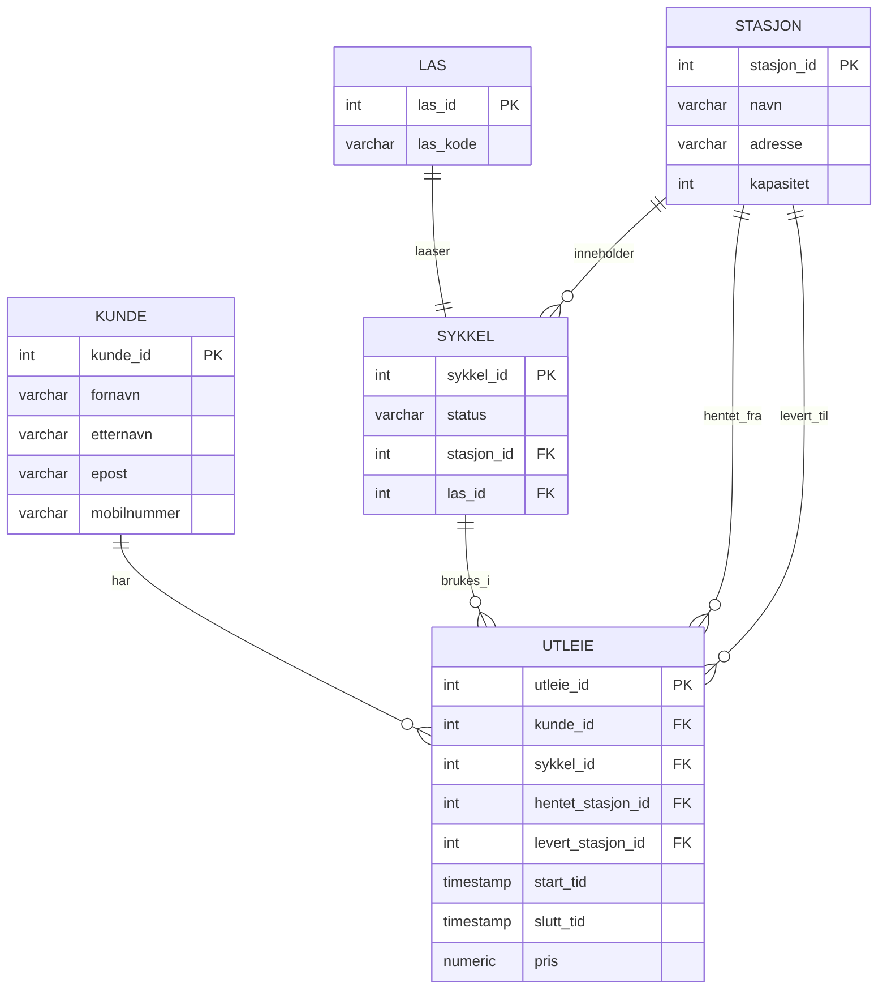

# Besvarelse - Refleksjon og Analyse

**Student: EYAD ALAWAK

**Studentnummer: 02019119176

**Dato: 15.02.26

---

## Del 1: Datamodellering

### Oppgave 1.1: Entiteter og attributter

**Identifiserte entiteter:**

Jeg har identifisert følgende entiteter i systemet:

- Kunde
- Sykkel
- Stasjon
- Lås
- Utleie

**Attributter for hver entitet:**

Attributter for hver entitet:

Kunde:
- kunde_id
- fornavn
- etternavn
- epost
- mobilnummer
- registrert_dato

Sykkel:
- sykkel_id
- status
- stasjon_id
- lås_id

Stasjon:
- stasjon_id
- navn
- adresse
- kapasitet

Lås:
- lås_id
- lås_kode
- aktiv

Utleie:
- utleie_id
- kunde_id
- sykkel_id
- hentet_stasjon_id
- levert_stasjon_id
- start_tid
- slutt_tid
- pris

---

### Oppgave 1.2: Datatyper og `CHECK`-constraints

**Valgte datatyper og begrunnelser:**

Jeg har valgt følgende datatyper:

- ID-felter: INTEGER / SERIAL
- Tekstfelt (navn, adresse, epost): VARCHAR
- Dato og tid: TIMESTAMP
- Pris: NUMERIC(8,2)
- Status: VARCHAR eller BOOLEAN

**`CHECK`-constraints:**

Eksempler på CHECK-constraints:

- pris > 0
- kapasitet >= 0
- status IN ('tilgjengelig', 'utleid')

**ER-diagram:**



---

### Oppgave 1.3: Primærnøkler

**Valgte primærnøkler og begrunnelser:**

Jeg har brukt surrogate primærnøkler (auto-increment INTEGER) for alle tabeller:
kunde_id, sykkel_id, stasjon_id, lås_id og utleie_id.
Dette gjør systemet enklere og mer fleksibelt.

**Naturlige vs. surrogatnøkler:**

Naturlige nøkler kan være epost eller mobilnummer, men disse kan endres.
Derfor valgte jeg surrogate nøkler som er mer stabile.

**Oppdatert ER-diagram:**

SE ER-diagram over.

---

### Oppgave 1.4: Forhold og fremmednøkler

**Identifiserte forhold og kardinalitet:**

Forhold mellom entiteter:

- En stasjon har mange sykler (1-m)
- En kunde kan ha mange utleier (1-m)
- En sykkel kan ha mange utleier (1-m)
- En utleie tilhører én kunde og én sykkel

**Fremmednøkler:**

- sykkel.stasjon_id → stasjon.stasjon_id
- sykkel.lås_id → lås.lås_id
- utleie.kunde_id → kunde.kunde_id
- utleie.sykkel_id → sykkel.sykkel_id
- utleie.hentet_stasjon_id → stasjon.stasjon_id
- utleie.levert_stasjon_id → stasjon.stasjon_id


**Oppdatert ER-diagram:**

SE ER-diagram over.

---

### Oppgave 1.5: Normalisering

**Vurdering av 1. normalform (1NF):**

Datamodellen tilfredsstiller 1NF fordi alle tabeller har atomiske verdier.
Det finnes ingen lister eller flere verdier i samme felt.
For eksempel har hver kunde ett mobilnummer per rad, og hver sykkel har én status.
Alle kolonner inneholder én verdi per celle.


**Vurdering av 2. normalform (2NF):**

Datamodellen tilfredsstiller 2NF fordi alle ikke-nøkkel-attributter er fullt avhengige av hele primærnøkkelen.
Hver tabell har en enkel primærnøkkel (ID), og informasjon som pris, start_tid og slutt_tid avhenger kun av utleie_id i UTLEIE-tabellen.
Det finnes ingen delvise avhengigheter.


**Vurdering av 3. normalform (3NF):**

Datamodellen tilfredsstiller 3NF fordi det ikke finnes transitive avhengigheter.
For eksempel er informasjon om stasjon lagret i STASJON-tabellen og ikke i SYKKEL eller UTLEIE.
Kundedata er kun i KUNDE-tabellen.
Dette reduserer duplisering og inkonsistens.


**Eventuelle justeringer:**

Hvis modellen ikke var i 3NF, kunne vi fått duplisert data, for eksempel at stasjonsadresse ble lagret i flere tabeller.
Jeg løste dette ved å flytte informasjon til egne tabeller og bruke fremmednøkler.


---

## Del 2: Database-implementering

### Oppgave 2.1: SQL-skript for database-initialisering

**Plassering av SQL-skript:**

[Bekreft at du har lagt SQL-skriptet i `init-scripts/01-init-database.sql`]

**Antall testdata:**

- Kunder: [antall]
- Sykler: [antall]
- Sykkelstasjoner: [antall]
- Låser: [antall]
- Utleier: [antall]

---

### Oppgave 2.2: Kjøre initialiseringsskriptet

**Dokumentasjon av vellykket kjøring:**

[Skriv ditt svar her - f.eks. skjermbilder eller output fra terminalen som viser at databasen ble opprettet uten feil]

**Spørring mot systemkatalogen:**

```sql
SELECT table_name 
FROM information_schema.tables 
WHERE table_schema = 'public' 
  AND table_type = 'BASE TABLE'
ORDER BY table_name;
```

**Resultat:**

```
[Skriv resultatet av spørringen her - list opp alle tabellene som ble opprettet]
```

---

## Del 3: Tilgangskontroll

### Oppgave 3.1: Roller og brukere

**SQL for å opprette rolle:**

```sql
[Skriv din SQL-kode for å opprette rollen 'kunde' her]
```

**SQL for å opprette bruker:**

```sql
[Skriv din SQL-kode for å opprette brukeren 'kunde_1' her]
```

**SQL for å tildele rettigheter:**

```sql
[Skriv din SQL-kode for å tildele rettigheter til rollen her]
```

---

### Oppgave 3.2: Begrenset visning for kunder

**SQL for VIEW:**

```sql
[Skriv din SQL-kode for VIEW her]
```

**Ulempe med VIEW vs. POLICIES:**

[Skriv ditt svar her - diskuter minst én ulempe med å bruke VIEW for autorisasjon sammenlignet med POLICIES]

---

## Del 4: Analyse og Refleksjon

### Oppgave 4.1: Lagringskapasitet

**Gitte tall for utleierate:**

- Høysesong (mai-september): 20000 utleier/måned
- Mellomsesong (mars, april, oktober, november): 5000 utleier/måned
- Lavsesong (desember-februar): 500 utleier/måned

**Totalt antall utleier per år:**

[Skriv din utregning her]

**Estimat for lagringskapasitet:**

[Skriv din utregning her - vis hvordan du har beregnet lagringskapasiteten for hver tabell]

**Totalt for første år:**

[Skriv ditt estimat her]

---

### Oppgave 4.2: Flat fil vs. relasjonsdatabase

**Analyse av CSV-filen (`data/utleier.csv`):**

**Problem 1: Redundans**

[Skriv ditt svar her - gi konkrete eksempler fra CSV-filen som viser redundans]

**Problem 2: Inkonsistens**

[Skriv ditt svar her - forklar hvordan redundans kan føre til inkonsistens med eksempler]

**Problem 3: Oppdateringsanomalier**

[Skriv ditt svar her - diskuter slette-, innsettings- og oppdateringsanomalier]

**Fordeler med en indeks:**

[Skriv ditt svar her - forklar hvorfor en indeks ville gjort spørringen mer effektiv]

**Case 1: Indeks passer i RAM**

[Skriv ditt svar her - forklar hvordan indeksen fungerer når den passer i minnet]

**Case 2: Indeks passer ikke i RAM**

[Skriv ditt svar her - forklar hvordan flettesortering kan brukes]

**Datastrukturer i DBMS:**

[Skriv ditt svar her - diskuter B+-tre og hash-indekser]

---

### Oppgave 4.3: Datastrukturer for logging

**Foreslått datastruktur:**

[Skriv ditt svar her - f.eks. heap-fil, LSM-tree, eller annen egnet datastruktur]

**Begrunnelse:**

**Skrive-operasjoner:**

[Skriv ditt svar her - forklar hvorfor datastrukturen er egnet for mange skrive-operasjoner]

**Lese-operasjoner:**

[Skriv ditt svar her - forklar hvordan datastrukturen håndterer sjeldne lese-operasjoner]

---

### Oppgave 4.4: Validering i flerlags-systemer

**Hvor bør validering gjøres:**

[Skriv ditt svar her - argumenter for validering i ett eller flere lag]

**Validering i nettleseren:**

[Skriv ditt svar her - diskuter fordeler og ulemper]

**Validering i applikasjonslaget:**

[Skriv ditt svar her - diskuter fordeler og ulemper]

**Validering i databasen:**

[Skriv ditt svar her - diskuter fordeler og ulemper]

**Konklusjon:**

[Skriv ditt svar her - oppsummer hvor validering bør gjøres og hvorfor]

---

### Oppgave 4.5: Refleksjon over læringsutbytte

**Hva har du lært så langt i emnet:**

[Skriv din refleksjon her - diskuter sentrale konsepter du har lært]

**Hvordan har denne oppgaven bidratt til å oppnå læringsmålene:**

[Skriv din refleksjon her - koble oppgaven til læringsmålene i emnet]

Se oversikt over læringsmålene i en PDF-fil i Canvas https://oslomet.instructure.com/courses/33293/files/folder/Plan%20v%C3%A5ren%202026?preview=4370886

**Hva var mest utfordrende:**

[Skriv din refleksjon her - diskuter hvilke deler av oppgaven som var mest krevende]

**Hva har du lært om databasedesign:**

[Skriv din refleksjon her - reflekter over prosessen med å designe en database fra bunnen av]

---

## Del 5: SQL-spørringer og Automatisk Testing

**Plassering av SQL-spørringer:**

[Bekreft at du har lagt SQL-spørringene i `test-scripts/queries.sql`]


**Eventuelle feil og rettelser:**

[Skriv ditt svar her - hvis noen tester feilet, forklar hva som var feil og hvordan du rettet det]

---

## Del 6: Bonusoppgaver (Valgfri)

### Oppgave 6.1: Trigger for lagerbeholdning

**SQL for trigger:**

```sql
[Skriv din SQL-kode for trigger her, hvis du har løst denne oppgaven]
```

**Forklaring:**

[Skriv ditt svar her - forklar hvordan triggeren fungerer]

**Testing:**

[Skriv ditt svar her - vis hvordan du har testet at triggeren fungerer som forventet]

---

### Oppgave 6.2: Presentasjon

**Lenke til presentasjon:**

[Legg inn lenke til video eller presentasjonsfiler her, hvis du har løst denne oppgaven]

**Hovedpunkter i presentasjonen:**

[Skriv ditt svar her - oppsummer de viktigste punktene du dekket i presentasjonen]

---

**Slutt på besvarelse**
